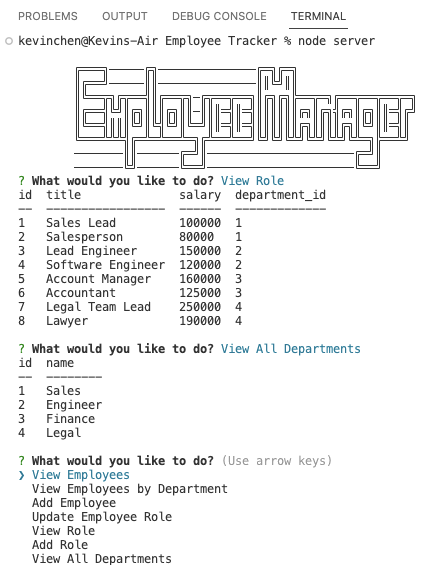

# Employee Tracker

## Description

Employee Tracker is an application that lets manager view and add employees, roles, and departments. Manager are able to manage all the important aspect of the business.

## Installation

Node.js 
NPM install 
Mysql install 
inquirier

## Link

https://github.com/realkevinC/Employee-Tracker 
https://drive.google.com/file/d/1BYRUThDW7qxVgkTbOHicFoIfeGQm8iFd/view
 

## Usage

In the command-line user will run Mysql in the mySQL folder. Source both schema.sql and seeds.sql in the mysql application. Then in ta new terminal run node server.js or npm start in the Employee Tracker folder. There you will be prompted with a list of choices. When done choose quit option.

## Credits

Kevin

## License

Please refer to the LICENSE in the repo.